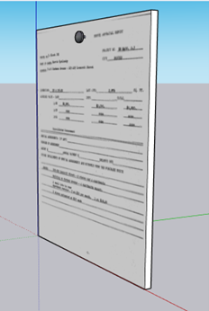
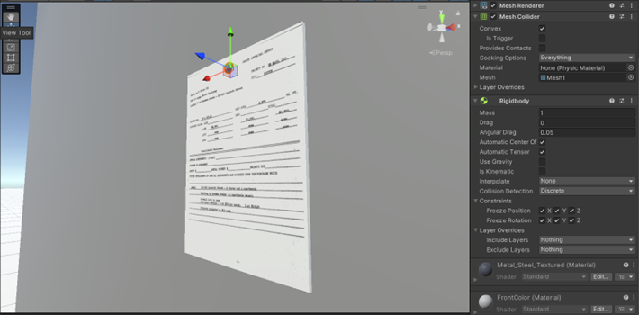
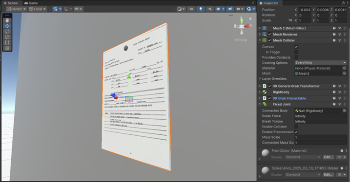
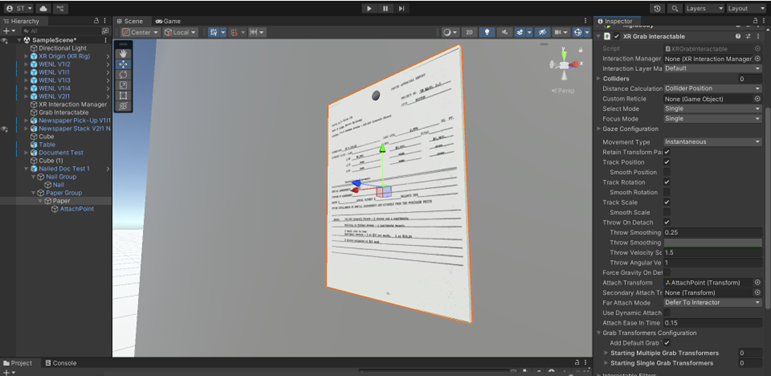

# Grabbable Documents

Users are able to grab an object to view it closer, then when released it snaps back to its default position

## Step 1

Design your object in SketchUp, I would recommend creating a small object at the point you want the object to attach to in this model as it makes it a bit easier to work with. If the object is sitting, this can be a small cylinder or similar object at the bottom of the object. If it is suspended, make what it is being held up by in the model itself. MAKE SURE YOU CREATE TWO SEPARATE GROUPINGS FOR THE MAIN OBJECT AND FOR THE ANCHOR TO ENSURE THE MESHES SHOW UP SEPARATE IN UNITY. For this example, a nailed sheet of paper will have 2 objects: the paper itself and the nail. For the material, import your image into SketchUp as a texture, apply it starting in one corner then moving it as far diagonally as possible, then adjust the fit as needed by right clicking, clicking on texture, and editing from there.

## Step 2

Import your object into Unity and position it where you want it to be, in the heirarchy ensure that your anchor point and grabbable are two separate mesh groups. Give both objects mesh colliders and check off the convex box in its dropdown menu. For the anchor point, give it a rigid body and uncheck use gravity and check all boxes that say freeze xyz. This ensures that the object stays completely stationary while still allowing it to act as an anchor.

## Step 3

For the grabbable, it requires a few more components: XR General Grab Transformer (which can remain default), XR Grab Interactable (which should remain default unless doing recommended section), and a Fixed Joint. Because the anchor point is a rigid body, it will be an option in the connected body box. After doing this, the object should be grabbable and when released return to its initial position.

## RECOMMENDED

If there are issues with your object not being grabbed upright, right-click on the grabbable and create empty. Position this relatively where you want the object to be held from. Go back to the object’s inspector, extend XR Grab Interactable, and navigate down to Attach Transform. In its dropdown menu, add the empty you just created. Test and play around with the rotation and positioning till it is grabbed correctly.

