# Creating Interactive Picture Frames with Captions in Unity VR
*A detailed implementation guide*

## Step 1: Set Up the Picture Frame Container

1. Create an empty GameObject to serve as the container:
   - Right-click in Hierarchy → Create Empty → name it "PictureFrame"
   - Position it where you want your frame (X: -28.56, Y: 1.61, Z: 1.1)
   - Scale it appropriately (X: 0.6, Y: 0.6, Z: 0.01)

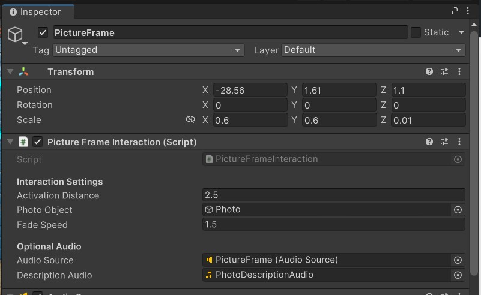

2. Add the PictureFrameInteraction script:
   - With PictureFrame selected, Add Component → Scripts → PictureFrameInteraction
   - Configure:
     - Activation Distance: 2.5
     - Drag your Photo object to "Photo Object" field
     - Fade Speed: 1.5

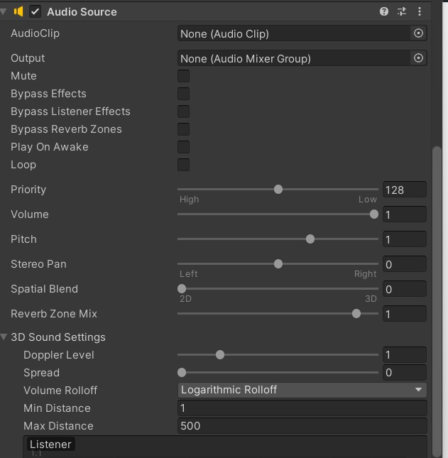

## Step 2: Create the Frame Element

1. Add a Quad for the frame border:
   - Right-click on PictureFrame → 3D Object → Quad → name it "Frame"
   - Position it relative to parent: X: 0, Y: -0.08, Z: -0.2
   - Scale it to create a border: X: 3, Y: 3, Z: 0

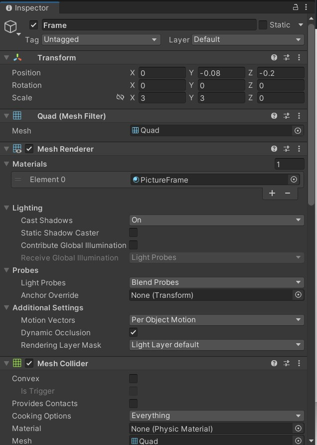

2. Configure the Frame material:
   - Create a purple material
   - Shader: Universal Render Pipeline/Lit
   - Workflow Mode: Metallic
   - Surface Type: Opaque

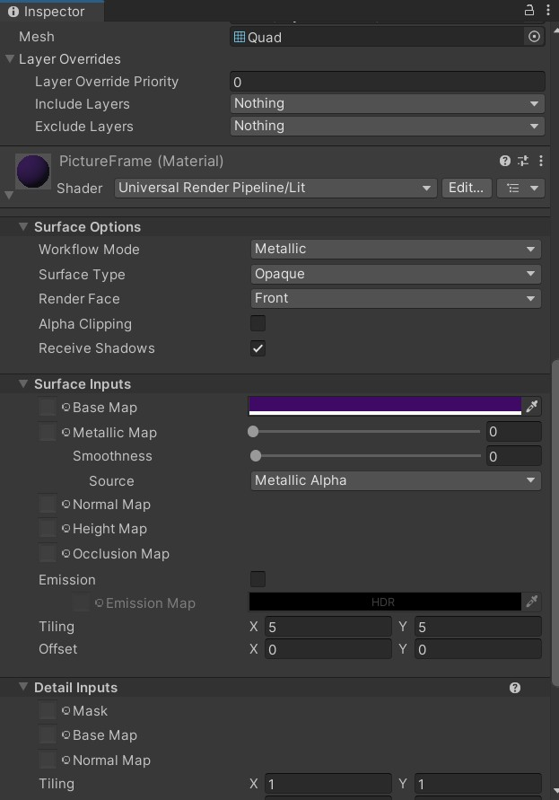
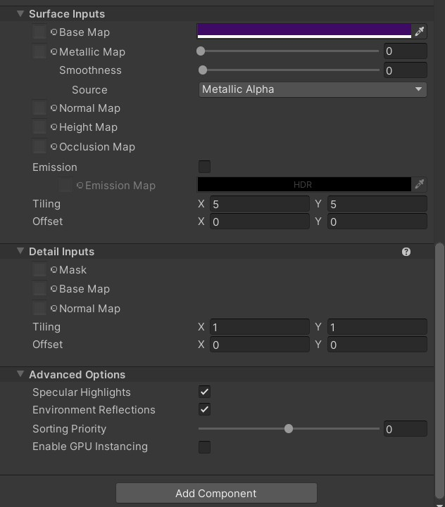

## Step 3: Add the Photo Element

1. Create a Quad for the photo:
   - Right-click on PictureFrame → 3D Object → Quad → name it "Photo"
   - Position it slightly in front of the frame: X: 0, Y: -0.1, Z: -0.7
   - Scale it smaller than the frame: X: 2.5, Y: 2.5, Z: 0

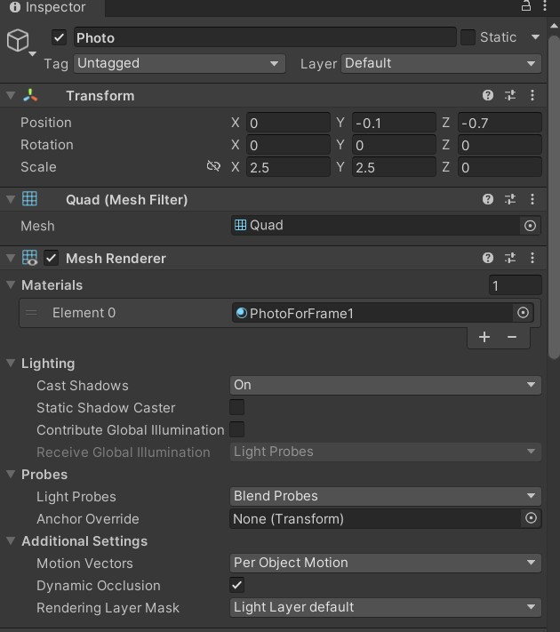

2. Configure the Photo material:
   - Create a material named "PhotoForFrame1"
   - Add your historical photo texture to Base Map

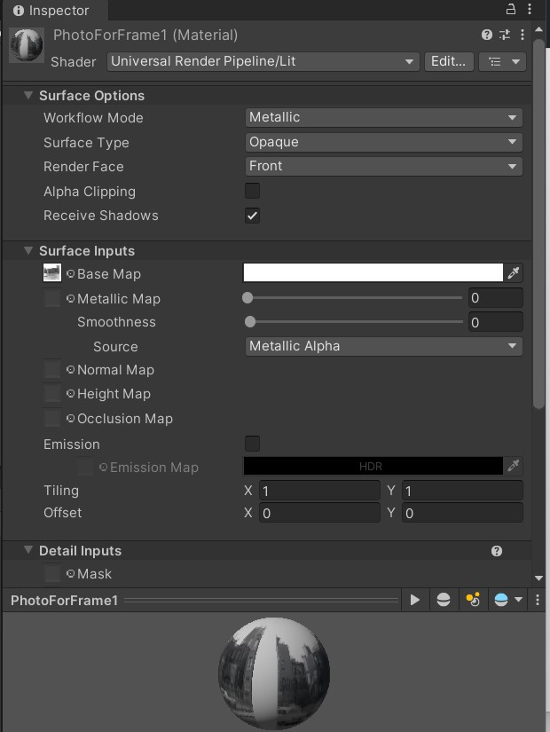
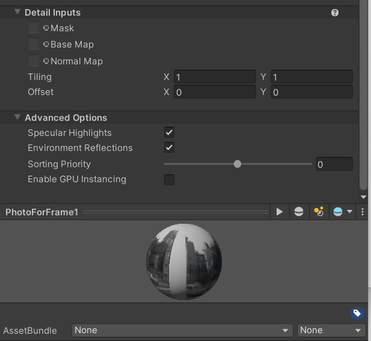
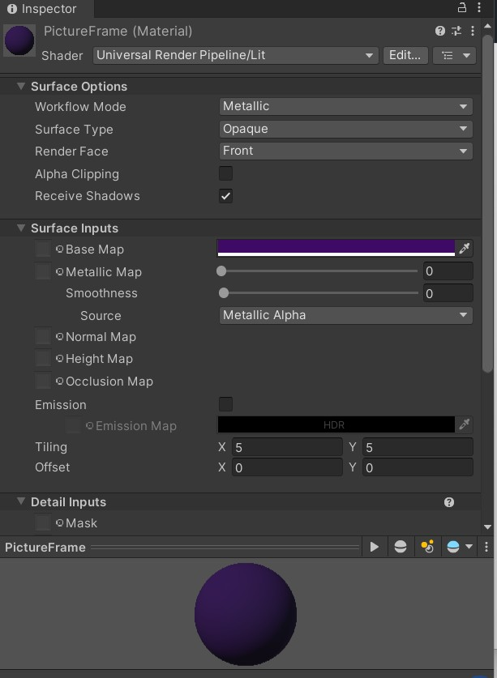

## Step 4: Add a Caption Plate

1. Create a Cube for the caption plate:
   - Right-click in Hierarchy → 3D Object → Cube → name it "CaptionPlate"
   - Position it below the frame: X: -27.17, Y: 0.883, Z: 1.233
   - Rotate it as needed: X: 0, Y: 180, Z: 0
   - Scale it for a plaque-like shape: X: 0.6, Y: 0.25, Z: 0.02

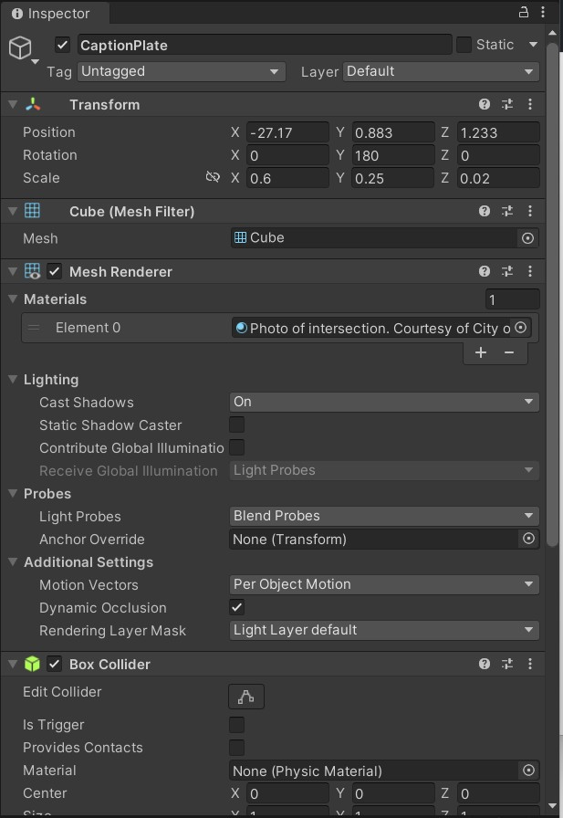

2. Apply a material with the caption text:
   - Instead of using TextMeshPro, use a material with pre-rendered caption
   - Shader: Unlit/Texture
   - Base Map: Your caption image

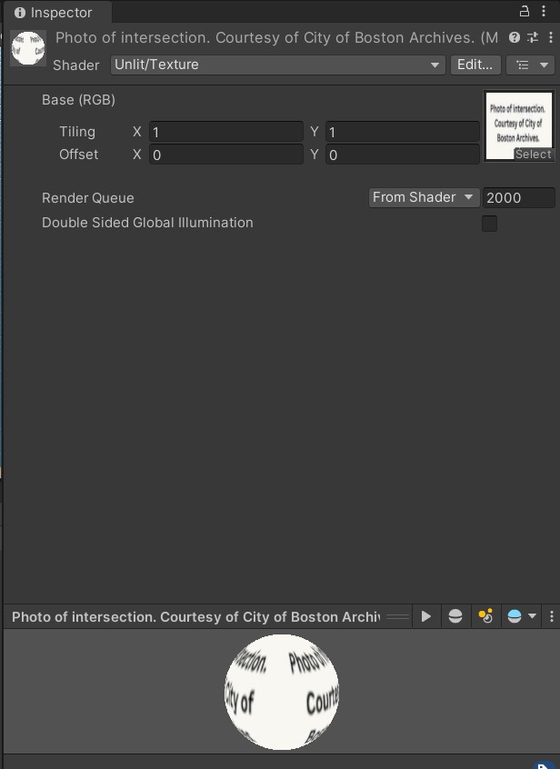

3. Configure the caption texture import settings:
   - Texture Type: Default
   - Texture Shape: 2D
   - sRGB (Color Texture): Checked

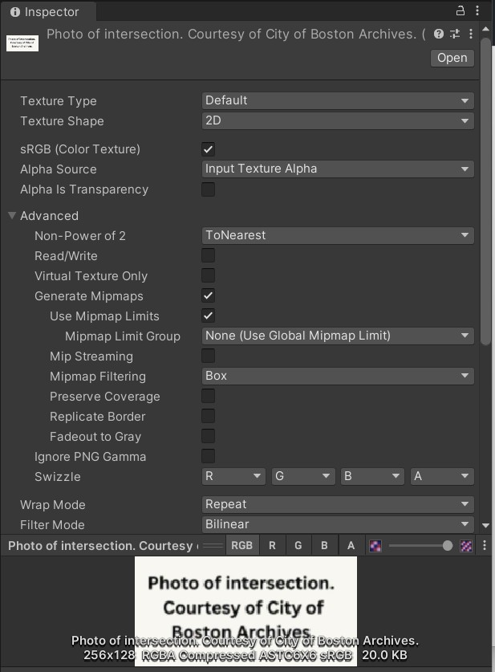
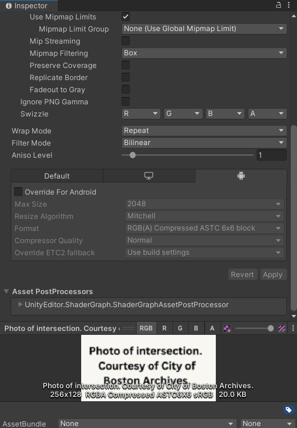

## Step 5: Link Everything to the Interaction Script

1. Ensure the PictureFrameInteraction script is properly connected:
   - Photo Object reference is set correctly
   - Audio source references are set (if using audio)

2. Testing proximity and interaction:
   - In Play mode, approach the picture frame
   - The photo should fade in when you get within 2.5 units
   - Walk away to see it fade out

## Implementation Notes

- For stable text in VR, use pre-rendered images for captions
- Set shader to Unlit/Texture for caption materials to reduce wobbling
- For the photo material, set Smoothness to 0 to reduce unwanted reflections

